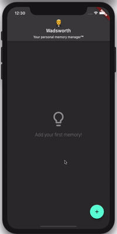

# Wadsworth

This app was created to showcase the basics of persistent, state-driven Flutter development.

To use, open the application and insert new items using the form that pops up. To delete an existing item, simply swipe it away. Items are automatically saved to a local database and reloaded between application starts. Internally, these items are referred to as "lifelogs."

## Features

- State management using [bloc](https://bloclibrary.dev). State management events, blocs, and state classes can be found in `/lib/blocs`.

- Persistent storage using [SQFlite](https://pub.dev/packages/sqflite). When items are added or removed, they are converted into intermediate entities that make exchange with the database a little easier. The state management code interfaces with the child project `lifelog_repo` to handle loading and saving from the database.

- Pull-to-refresh: fires a reload state event which causes the state management to get all of the lifelogs from the database.

- Form validation for the lifelog entry form. If you try and submit a lifelog without adding any thoughts it will show you an error and prevent you from continuing.

### Roadmap

- [x] Create a repository/client to enable easy testing.
- [X] Example Bloc test
- [x] Example widget test
- [ ] Add a tip-of-the-day using a free online API
- [ ] Improve performance of add/remove lifelogs by caching database results